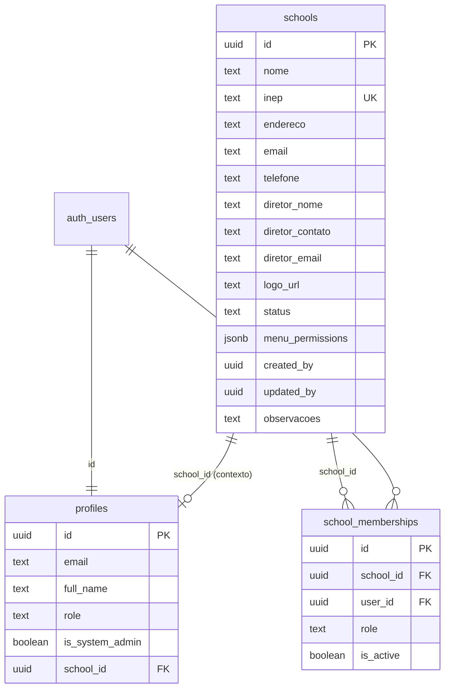

# Estrutura do banco — SIGA EDUCA (multi-escola)

Projeto Supabase: `digjzihjboflcuftmokj` (`sigaeduca`)

## Fluxo do Administrador do Sistema

1. **Login** (`login.html`) → Auth Supabase  
2. **Painel Admin** (`paineladmin.html`) → lista de escolas  
3. **Acessar Painel** (botão verde) → grava escola ativa → `painelprincipal.html`  
4. Operar só o contexto daquela escola  
5. Voltar ao admin para trocar de escola  

## Diagrama (núcleo atual)



## Tabelas

### `public.profiles`
Perfil ligado a `auth.users`.  
- `is_system_admin = true` → acesso ao `paineladmin.html`  
- `school_id` → última escola selecionada (contexto)

### `public.schools`
Uma linha por unidade escolar (tenant).  
- `inep` único (8–12 dígitos; normalizado no trigger)  
- `menu_permissions` JSON com flags das abas do menu (`turmas`, `alunos`, …)  
- `status`: `Ativa` | `Inativa`  
- `created_by` / `updated_by` preenchidos pelo trigger `trg_schools_audit`  
- SQL detalhado: [sql/schools_creation.sql](./sql/schools_creation.sql) · [PAINEL_ADMIN_DATABASE.md](./PAINEL_ADMIN_DATABASE.md)

### `public.school_memberships`
Quem pode trabalhar em cada escola (futuro: diretor, professor, etc.).  
Admin do sistema **não precisa** de membership para gerenciar tudo.

### `public.academic_years`
Ano letivo por escola (base do Calendário Letivo e Turmas).  
Criado no **Menu 1 — Minha Escola**. Ver [PAINEL_ESCOLA_DATABASE.md](./PAINEL_ESCOLA_DATABASE.md).

## RLS (resumo)

| Tabela | Quem lê | Quem escreve |
|--------|---------|--------------|
| `schools` | Admin sistema **ou** membro ativo | Só admin sistema |
| `school_memberships` | Admin **ou** o próprio usuário | Só admin sistema |
| `profiles` | Próprio (+ admin lê todos) | Próprio (sem se auto-promover) |

Função auxiliar: `public.is_system_admin()`.

## Próximas tabelas (mesmo padrão)

Toda entidade de negócio deve ter `school_id uuid NOT NULL REFERENCES schools(id)` + RLS:

```text
classes (turmas)
students (alunos)
attendance (frequência)
occurrences
agenda_events
documents
grades / boletins
…
```

Exemplo de política:

```sql
USING (
  public.is_system_admin()
  OR school_id IN (
    SELECT m.school_id FROM public.school_memberships m
    WHERE m.user_id = auth.uid() AND m.is_active
  )
)
```

## Storage (futuro)

Bucket privado `school-assets/{school_id}/logo.png` com policies por tenant.  
Hoje o logo pode ficar como URL/texto; data URLs grandes não devem ir para o banco.

## Cliente local

- Config: `js/siga-config.local.js` (não versionado)  
- Escola ativa (cache UI): `localStorage.siga_active_school`  
- Fonte da verdade das escolas: tabela `schools` no Supabase (com cache local de apoio)
